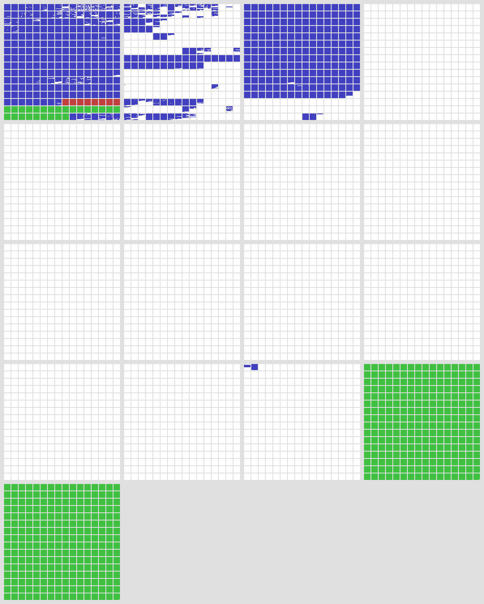

### 编码
- 端格式（也叫字节序）
  多字节编码首先要确定的东西就是端格式。
  - 小端格式（常见，适合机器）：低序字节低位编址
  - 大端格式（直观）：低序字节高位编址
  没有说明的话一般都是大端格式
- GBK
  - 中文编码
  - 变长编码，单字节编码兼容ASCII，双字节编码中文和图案
  - 双字节编码中，首字节0x81~0xFE（即开头一位为1），尾字节0x40~0xFE（即开头一位不一定是1）
  - 中文Windows下的默认编码，与Windows API交互时所有中文都必须是GBK编码
- Unicode与UCS
  - 统一码，采用固定长度编码（如两字节、四字节），旨在编码所有的字符
  - 两个字符集合：UCS-2和UCS-4
    - UCS=Univeral Character Set
    - 两者分别是2/4字节编码
    - UCS-2范围：0x0~0xFFFF（特别的，没有定义0xFFFE）
    - UCS-4范围：0x0~0x7FFFFFFF，即UCS-2是UCS-4的真子集
  - Unicode最初设计是16位，后来扩充到了21位，即Unicode编码范围是0x0~0x10FFFF，因此Unicode是UCS-4的子集，是UCS-2的超集
  - > Unicode 编码空间包含 1，114,112 个编码点。然而，其中只有128,237 个编码点 —— 编码空间的 12% 被赋值，目前。还有很多空间用来增长！Unicode 还保留了另外 137,468 字符 作为 “自用” 空间，这些字符没有标准的含义，可以被个人应用所使用。
    > 为了对编码空间的布局有个了解，把它可视化会比较直观。下面是整个编码空间的布局，一个像素代表一个编码点。使用小方块来表示以保证视觉的一致性；每个小方块是 16×16 = 256 个编码点，每个大方块是一个面有 65536 个 编码点。总共加起来有 17 个面板。
    > 
    > - 白色表示未用空间；
    > - 蓝色表示已用空间；
    > - 绿色表示自用区域；
    > - 小的红色区域是代理区。
    > - 其中第一个面板被称作『基本多语言面板（Basic Multilingual Plane，简称 BMP）』。BMP包含现代文本所需的基本所有字符，包括拉丁文、斯拉夫文、希腊文、汉字（中国），日文、朝鲜文、阿拉伯文、希伯来文、梵文（印度）等等。这个面板就是最初Unicode设计所占用的空间(16位，65536个字符)。后来扩展到现在这个规模，然而，大部分现代字符在BMP的范围内。
    > 第二个面板则是包括历史上的文字，比如苏美尔楔形文字和埃及象形文字还有今天我们说起的emoji表情。第三个面板包含一大块不常用的和历史上的汉字字符。剩下的是空的，除了 倒数第三个面板中有一小部分被用作格式化字符；倒数两个面板全部保留自用。
  - Unicode编码只指定了码点，没有指定编码方式，所以需要UTF系列确定编码方式
- UTF（Unicode Transformation Format）
  - UTF-8
    - 变长编码，“8”指的是以8位1字节为单位进行编码
    - 可以编码所有Unicode字符（指0x0~0x10FFFF）
    - 字节为单位编码，无需BOM
    - 一个字节只能编码7位的原ASCII码，拓展ASCII字符以及非ASCII字符都至少需要两个字节
    - 如果只有一个字节则其最高二进制位为0；如果是多字节，其第一个字节从最高位开始，连续的二进制位值为1的个数决定了其编码的字节数，其余各字节均以10开头（1开头的特性可用于粗略判断中文）
    - 无法从Unicode串长度推出UTF-8串长度
    - 很多老系统会错误地处理UTF-8编码的串
  - UTF-16与UTF-32
    - 变长编码，分别以16/32位为单位编码
    - 编码超出传统Unicode范围的字符，UTF-32最多可以涵盖到UCS-4全体
    - 多字节编码，需确定端格式
    - BOM（Bytes Order Mark）
      - 在文本开头的两字节记号，用于标识端格式
      - 原理是UCS-2没有定义0xFFFE码点，可以用来判断UTF-16或UTF-32端格式
      - 这就是为什么不要用记事本来编辑中文：自作聪明的记事本在保存Unicode时会加BOM，导致很多程序的处理出错
      - 区别JavaScirpt的BOM(Browser Object Model)（雾）
    - UTF-32由于至少要4字节，编码ACSII字符很多的文本非常浪费（很多0x0字节），故比较少用
  - UTF-16是特殊的。由于Unicode最初的设计范围是16位两字节，所以UTF-16与Unicode码点实际上是可以一一对相应的。
  - 许多编程语言的默认字符编码都是UTF-16如Java,Python
  - 由于Unicode后来扩充到了21位（0x10FFFF），为了让UTF-16能访问到后面的码点，采用了“代理对”的方法处理（不重要）
- 在实际使用中中UTF-8最常用，兼顾编码储存效率（单字节），不需要BOM，以及编码范围较大（涵盖Unicode）。UTF-8是Web领域的事实标准
- 编码一些特殊字符（如表情）的时候GBK是不够的，只能用UTF-8
- 编码一些很特殊的字符（如某些emoji，带音标记的西方文字时）UTF-8也不够，只能是UTF-16或UTF-32
- 存在组合编码（或者说字位簇）时，UTF-32也不一定够（比如某些丧心病狂的emoji需要6字节Unicode编码）